 

<code>777reet@github ~ $ ./contributions.sh</code>

  

  

<code>777reet@github ~ $ whoami</code>

  

<table>
<tr>
<td valign="top" width="290">

</td>

<td valign="top" width="470">

</td>
</tr>
</table>

 

<code>─────────────────── ◈ ───────────────────</code>

  

<code>build &nbsp;·&nbsp; break &nbsp;·&nbsp; learn &nbsp;·&nbsp; rebuild ♡</code>

  

dark mode enthusiast · API enjoyer · occasionally fighting bugs at 2am

